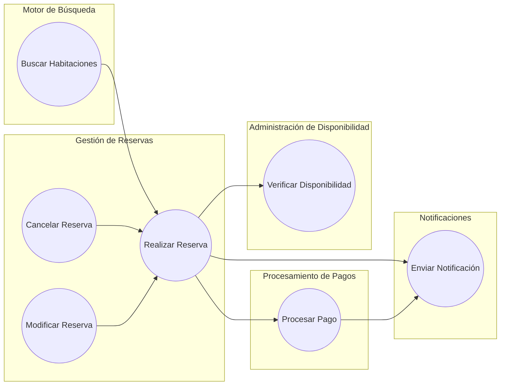
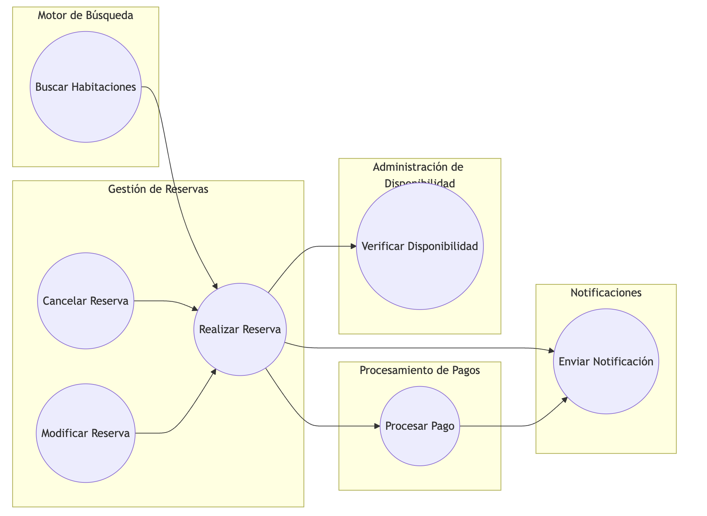
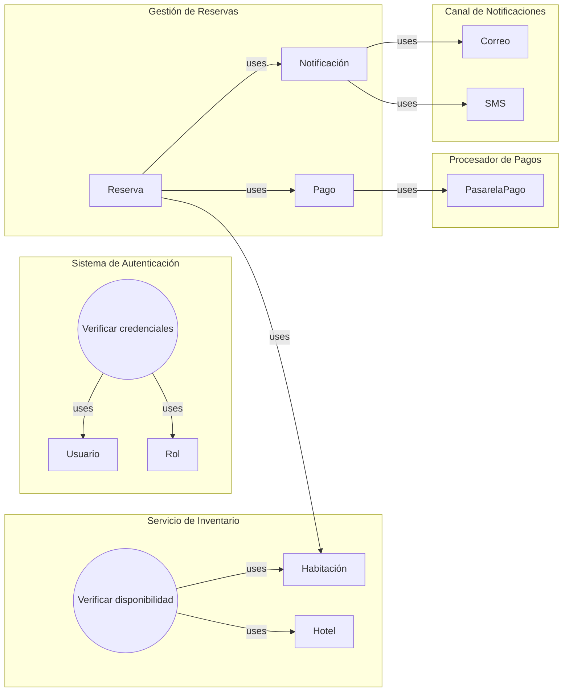
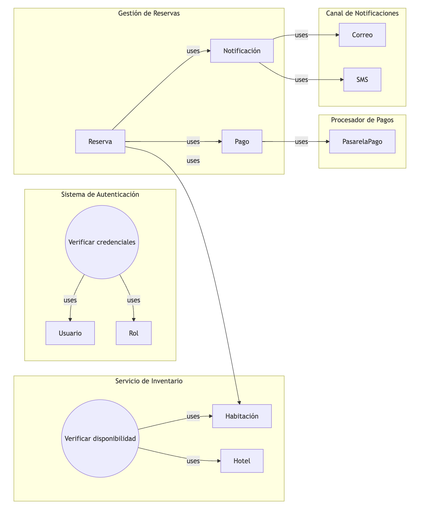
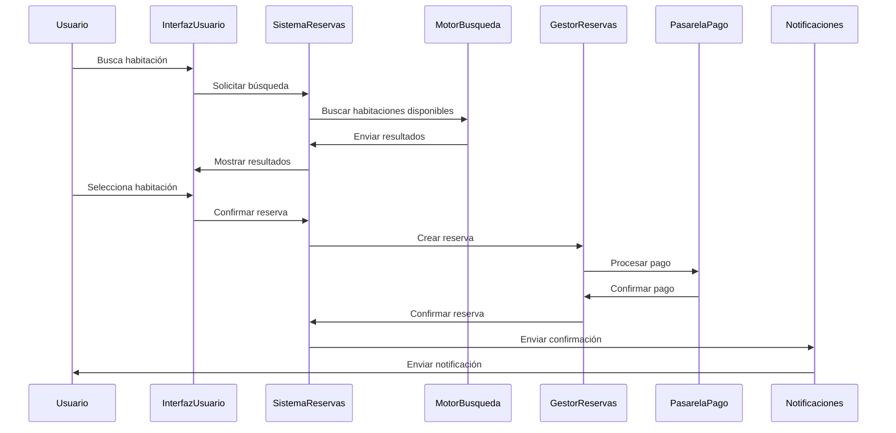
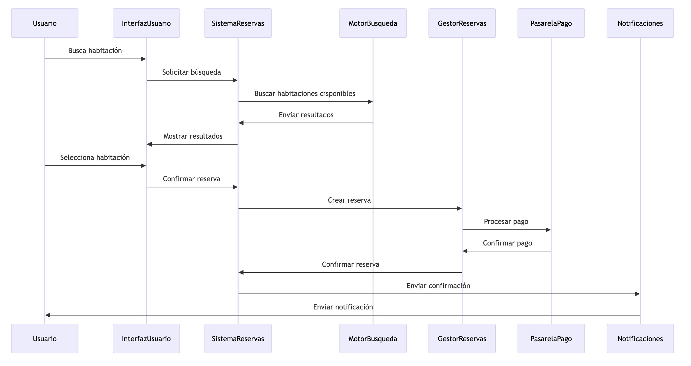
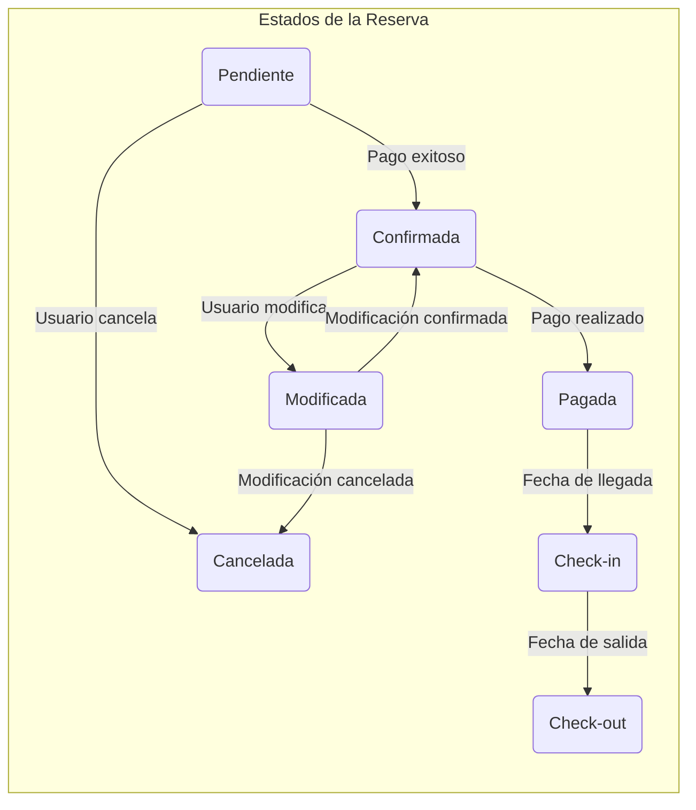

2. Generación de Diagramas con IA
**a. Diagrama de Arquitectura de Software en Mermaid:**

Esto se vería de la siguiente manera:

**b. Diagrama UML de Componentes:**

Esto se vería de la siguiente manera:

**c. Diagrama de Secuencia UML:**

Esto se vería de la siguiente manera:

**d. Diagrama de Transición de Estados:**

Esto se vería de la siguiente manera:

### 3. Estructura de Carpetas del Proyecto
```tree
/reservation-system
│
├── frontend/
│   ├── web-app/
│   │   ├── public/                 # Archivos públicos como index.html, favicon, etc.
│   │   ├── src/
│   │   │   ├── assets/             # Imágenes, fuentes, estilos globales
│   │   │   ├── components/         # Componentes reutilizables de UI
│   │   │   ├── pages/              # Páginas principales del sitio web
│   │   │   ├── services/           # Lógica de comunicación con la API backend
│   │   │   ├── store/              # Manejo del estado global (por ejemplo, Redux)
│   │   │   ├── utils/              # Funciones utilitarias
│   │   │   └── App.js              # Componente principal de la aplicación
│   │   └── package.json            # Dependencias y scripts de la aplicación web
│   │
│   └── mobile-app/
│       ├── assets/                 # Imágenes y recursos específicos para móviles
│       ├── src/
│       │   ├── components/         # Componentes reutilizables de UI para móviles
│       │   ├── screens/            # Pantallas principales de la app móvil
│       │   ├── services/           # Lógica de comunicación con la API backend
│       │   ├── store/              # Manejo del estado global
│       │   ├── utils/              # Funciones utilitarias
│       │   └── App.js              # Componente principal de la app móvil
│       └── package.json            # Dependencias y scripts de la app móvil
│
├── backend/
│   ├── auth-service/               # Servicio de autenticación
│   │   ├── src/
│   │   │   ├── controllers/        # Controladores para manejar solicitudes HTTP
│   │   │   ├── models/             # Modelos de la base de datos
│   │   │   ├── routes/             # Definición de rutas y middlewares
│   │   │   ├── services/           # Lógica de negocio relacionada con la autenticación
│   │   │   ├── utils/              # Funciones utilitarias
│   │   │   └── index.js            # Punto de entrada del servicio
│   │   └── package.json
│   │
│   ├── booking-service/            # Servicio principal para gestionar reservas
│   │   ├── src/
│   │   │   ├── controllers/
│   │   │   ├── models/
│   │   │   ├── routes/
│   │   │   ├── services/
│   │   │   ├── utils/
│   │   │   └── index.js
│   │   └── package.json
│   │
│   ├── payment-service/            # Servicio para gestionar pagos
│   │   ├── src/
│   │   │   ├── controllers/
│   │   │   ├── models/
│   │   │   ├── routes/
│   │   │   ├── services/
│   │   │   ├── utils/
│   │   │   └── index.js
│   │   └── package.json
│   │
│   ├── notification-service/       # Servicio para envío de notificaciones
│   │   ├── src/
│   │   │   ├── controllers/
│   │   │   ├── models/
│   │   │   ├── routes/
│   │   │   ├── services/
│   │   │   ├── utils/
│   │   │   └── index.js
│   │   └── package.json
│   │
│   ├── inventory-service/          # Servicio para gestionar la disponibilidad e inventario
│   │   ├── src/
│   │   │   ├── controllers/
│   │   │   ├── models/
│   │   │   ├── routes/
│   │   │   ├── services/
│   │   │   ├── utils/
│   │   │   └── index.js
│   │   └── package.json
│   │
│   └── api-gateway/                # API Gateway para enrutar solicitudes
│       ├── src/
│       │   ├── controllers/
│       │   ├── routes/
│       │   ├── services/
│       │   ├── utils/
│       │   └── index.js
│       └── package.json
│
├── integration/
│   ├── payment-gateways/           # Integración con pasarelas de pago
│   │   ├── stripe/
│   │   │   ├── src/
│   │   │   │   └── client.js       # Cliente para interactuar con la API de Stripe
│   │   │   └── package.json
│   │   └── paypal/
│   │       ├── src/
│   │       │   └── client.js       # Cliente para interactuar con la API de PayPal
│   │       └── package.json
│   │
│   ├── external-api/               # Integración con APIs externas como Booking.com
│   │   ├── src/
│   │   │   ├── clients/            # Clientes para comunicarse con APIs externas
│   │   │   ├── services/           # Lógica de integración y sincronización
│   │   │   ├── utils/
│   │   │   └── index.js
│   │   └── package.json
│   │
│   └── messaging/                  # Servicios de mensajería y notificaciones
│       ├── email/
│       │   ├── src/
│       │   │   └── emailClient.js  # Cliente para enviar correos electrónicos
│       │   └── package.json
│       └── sms/
│           ├── src/
│           │   └── smsClient.js    # Cliente para enviar SMS
│           └── package.json
│
├── shared/
│   ├── configs/                    # Configuraciones compartidas (archivos de entorno, variables)
│   ├── constants/                  # Constantes compartidas entre servicios
│   ├── middleware/                 # Middlewares compartidos
│   ├── utils/                      # Utilidades comunes (por ejemplo, logger)
│   └── docs/                       # Documentación general del proyecto
│
└── deployment/
    ├── docker/                     # Archivos Docker para contenedores
    ├── kubernetes/                 # Archivos de configuración para despliegue en Kubernetes
    └── scripts/                    # Scripts de CI/CD para automatización de despliegues
```
### 4. Realizar pruebas básicas de funcionalidad y comunicación entre servicios
// services/reservationService.test.js
const reservationService = require('./reservationService');

describe('reservationService', () => {
  it('should create a new reservation', () => {
    const newReservation = reservationService.createReservation({
      // Datos de la reserva
    });
    expect(newReservation).toHaveProperty('id');
  });
});
